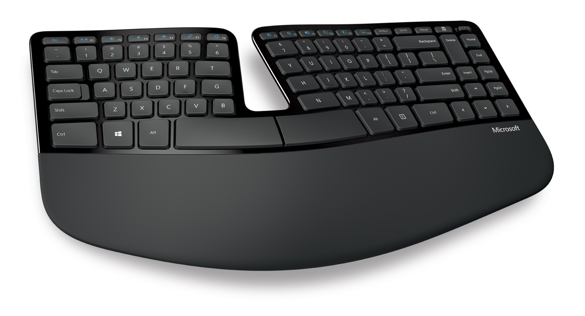

# VolumeChanger
An input-server filter add-on that provides support for Multimedia buttons on the keyboard. It's totally useless in case the Haiku runs in a virtual machine, only real hardware is supported.

### Check if your hardware is supported:
1. Grab the ["ScanCode printer" repository](https://github.com/ahitech/ScanCode-printer).
2. Make the binary according to its instructions.
3. Run the "ScanCode printer" binary.
4. With the "ScanCode printer" window active, press the multimedia keys on your keyboard.
   - If there is any output, chances are that this input_server add-on will work out of the box or after small modifications.
   - If there is no output on multimedia keys, but other keys work good, it means that on your keyboard the multimedia keys send ACPI events, not scancodes. This input_server filter does not support them. Bad luck.
   - If there is no output even on ordinary keys, (letters and numbers), you're doing something wrong. Return to step 1.

### Tested and supported keyboards:
   - Microsoft Natural Ergonomic Keyboard 4000
     
   - Microsoft Sculpt Ergonomic Desktop Keyboard
     
   - Sharkoon PureWriter mechanical keyboard
     
   - iPazzPort I8 Wireless keyboard and compatibles
     
   - Dexp KM-5002BU wireless desktop
     
   - Lenovo G530 laptop 
     The volume change buttons of this laptop send different scancodes, therefore the constants in the source need to be changed and the source recompiled, but after the recompilation it works perfectly.
     
     

This list will be updated as soon as more keyboards are tested and verified.

### Currently supported buttons: 
   - Volume Up               (Scancode 0xC00E9)
   - Volume Down             (Scancode 0xC00EA)
   - Mute                    (Scancode 0xC00E2)
   - Search                  (Scancode 0xC0221)
   - Open Web Browser        (Scancode 0xC0223)
    
This list is supposed to expand with the future releases.

### Installation:
1. copy the binary to ~/config/non-packaged/add-ons/input_server/filters
2. in a Terminal, type "/boot/system/servers/input_server -q" OR reboot
  
### Deinstallation (in case the add-on misbehaves):
1. On the computer's start-up, after Power-On Self Test, press "Space" like crazy. 
2. When the Haiku's boot options appear, be sure to check "Disable user add-ons". 
3. Then continue booting. 
4. As Haiku boots, remove the binary from ~/config/non-packaged/add-ons/input_server/filters.
5. Reboot.
    
### Changes list:
   - 2019-Jun-28 Initial release, "Volume Up" and "Volume Down" are working.
   - 2019-Jul-20 Adding full support for "Mute".
   - 2019-Dec-10 Added support for "Search" key (2 different scancodes).
   - 2019-Dec-12 Added support for "Web browser" key. Removed one of the "Search key" scancodes. (It's recommended to remove ~/config/settings/VolumeChanger.txt file before using this update to purge the removed 2nd scancode).

### ToDo list:
   - [x] Add support for the "Mute" key (highest priority).
   - [ ] Create a package and distribute the add-on through HaikuDepot.
   - [x] Add support for other multimedia keys.
   - [ ] Create a preferences applet for modifying scancodes and assigning actions to the keys which are not supported by the Shortcuts program.
